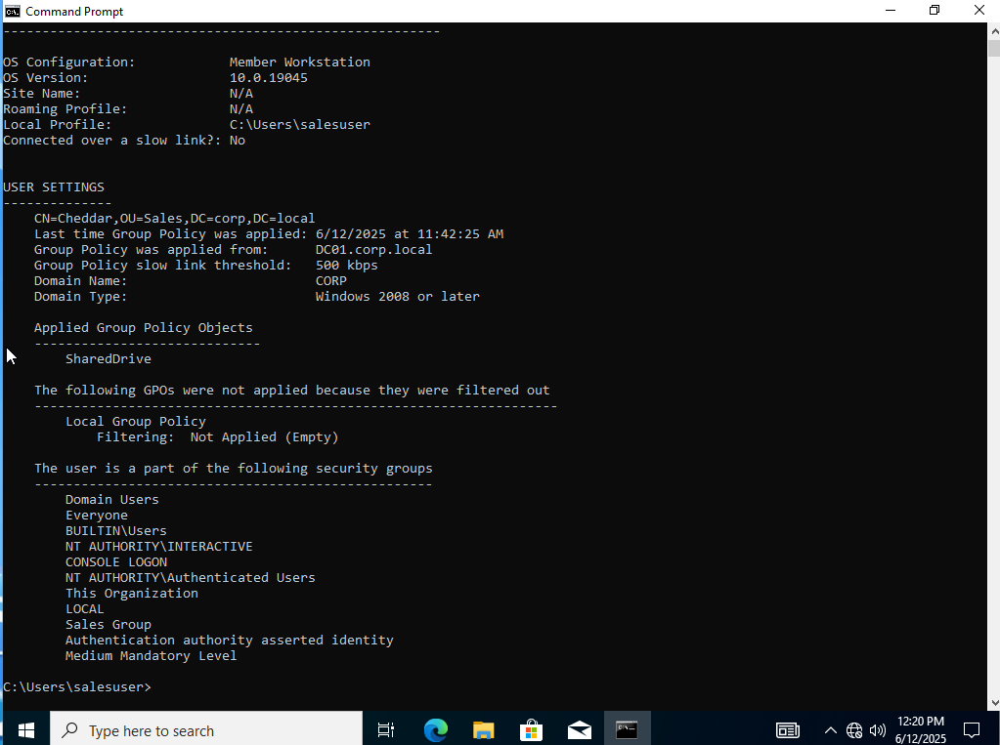

# 🧠 Active Directory Lab

This project simulates a basic enterprise network environment using **Windows Server 2022** and **Windows 10**, focusing on setting up **Active Directory**, **Group Policies**, and domain-joined clients.

## 🚀 Project Goals
- Deploy Windows Server as a Domain Controller
- Create organizational units (OUs), users, and security groups
- Configure and test Group Policy Objects (GPOs)
- Join Windows 10 clients to the domain
- Apply user- and computer-based policies

## 🛠️ Tools Used
- VirtualBox
- Windows Server 2022
- Windows 10 Pro
- Active Directory Domain Services (AD DS)
- Group Policy Management Console
- PowerShell (optional)

## 🏗️ Lab Architecture

- `DC01` → Domain Controller (`corp.local`)
- `Client01` → Domain-joined Windows 10 machine
- Network: Internal network (`192.168.100.x`)

## 📘 Documentation
See [documentation/lab-report.md](documentation/lab-report.md) for full step-by-step setup, screenshots, and lessons learned.

## 📷 Screenshots

| Description           | Image |
|-----------------------|-------|
| AD Users & Computers  |  |
| GPO Drive Mapping     |  |
| gpresult Output       |  |

## ✅ What I Learned
- How Active Directory works under the hood
- Why DNS is essential for domain communication
- Real-world examples of user policy enforcement
- Troubleshooting domain join and GPO failures

## 📌 Next Steps
- Add WSUS for patch management
- Automate user creation with PowerShell
- Add Linux client with Samba domain join

---

## 🧠 Want to Try This Lab?
All setup instructions are in the [lab-report.md](documentation/lab-report.md). Feel free to clone and try it yourself!