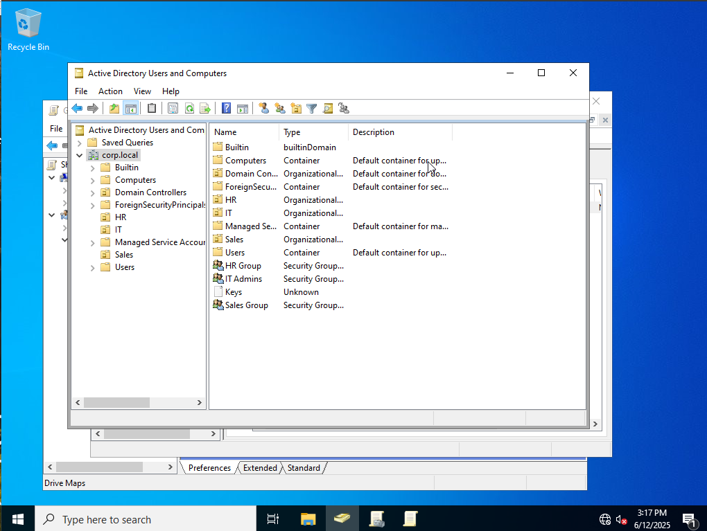
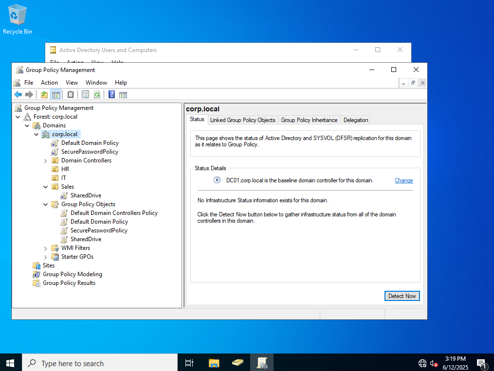
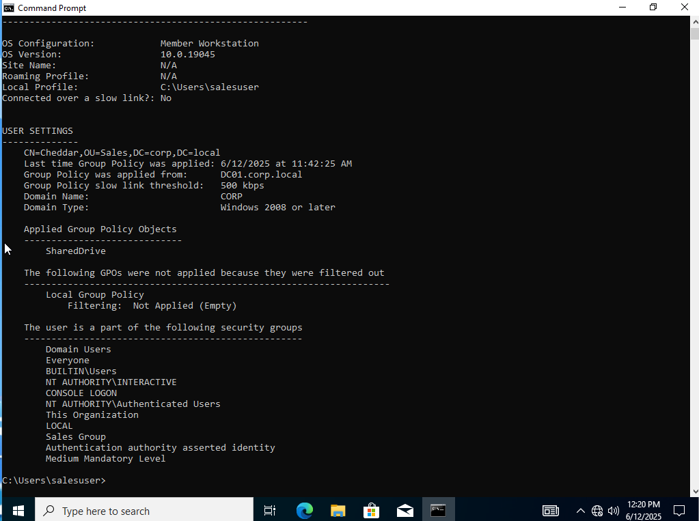
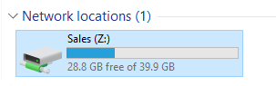

# 🧠 Active Directory Lab – Lab Report

## 📘 Overview

This lab simulates a small business environment using Windows Server 2022 and Windows 10 Pro to implement Active Directory, Group Policy, and basic domain infrastructure. The goal was to build hands-on experience with AD Domain Services, Group Policy Objects (GPOs), organizational structure, and domain client management.

---

## 🛠️ Lab Environment

| Component      | Details                          |
|----------------|----------------------------------|
| Hypervisor     | VirtualBox                       |
| Server OS      | Windows Server 2022 (Eval)       |
| Client OS      | Windows 10 Pro                   |
| Domain         | `corp.local`                     |
| Network Type   | Internal Network (`LabNet`)      |
| IP Scheme      | `192.168.100.0/24`               |

---

## 🖥️ Machines

### 📌 `DC01` – Domain Controller
- OS: Windows Server 2022
- Hostname: `DC01`
- Static IP: `192.168.100.10`
- Roles: AD DS, DNS

### 📌 `Client01` – Domain Client
- OS: Windows 10 Pro
- Hostname: `Client01`
- Static IP: `192.168.100.11`
- Role: Client joined to `corp.local`

---

## 🏗️ Network Architecture

> See 

- `DC01` provides DNS, DHCP (optional), and AD services
- `Client01` communicates with `DC01` to authenticate and receive policies

---

## ⚙️ Setup Summary

### 1. Install and Configure `DC01`
- Installed Windows Server 2022
- Assigned static IP: `192.168.100.10`
- Renamed to `DC01`
- Installed AD DS and DNS
- Promoted to domain controller with domain name: `corp.local`

### 2. Configure Active Directory
- Created Organizational Units:
  - `OU=IT`
  - `OU=HR`
  - `OU=Sales`
- Created Users:
  - `hruser`, `salesuser`, `itadmin`
- Created Groups:
  - `HR Group`, `Sales Group`, `IT Admins`
- Added users to relevant groups

### 3. Setup `Client01` and Join to Domain
- Installed Windows 10 Pro
- Renamed to `Client01`
- Assigned static IP: `192.168.100.11`, DNS: `192.168.100.10`
- Joined domain: `corp.local`
- Rebooted and logged in as `corp\hruser`

---

## 🔐 Group Policy Configuration

### GPO 1: Password Policy
- Enforces minimum password length of 12
- Complexity requirements enabled
- Applied to entire domain (`corp.local`)

### GPO 2: Network Drive Mapping for Sales
- Created shared folder: `\\DC01\Sales`
- Mapped as `Z:` drive via GPO
- GPO linked to `Sales` OU
- Applied only to `salesuser`

---

## ✅ Testing & Verification

### 🔹 Password Policy
- Attempted to change password as user with weak password → rejected
- Confirmed password rules via `gpresult /r`

### 🔹 Drive Mapping
- Logged in as `salesuser`
- Confirmed `Z:` drive mapped to `\\DC01\Sales`
- Verified access to files

---

## 🧪 Screenshots

| Task                     | Screenshot                             |
|--------------------------|-----------------------------------------|
| AD Users & Computers     |  |
| Group Policy Mgmt        |  |
| gpresult Output          |  |
| Drive Mapped in Explorer |  |

---

## 📚 Lessons Learned

- **DNS is critical** for domain join and policy enforcement.
- GPOs allow **powerful, centralized configuration** of user environments.
- **Testing policies** on a per-OU basis is key before deploying widely.
- Errors like misapplied GPOs often stem from **incorrect OU placement** or **permissions**.

---

## 🧠 Future Improvements

- Automate user and group creation via PowerShell
- Add WSUS server for patch testing
- Add second DC for replication
- Add Linux client and attempt Samba domain join
- Explore Restricted Groups and Group Policy Loopback Processing

---

## 🔗 Resources Used

- [Microsoft Docs – AD DS Overview](https://docs.microsoft.com/en-us/windows-server/identity/ad-ds/ad-ds-overview)
- [Windows Server Evaluation](https://www.microsoft.com/en-us/evalcenter/evaluate-windows-server-2022)
- [GPResult Syntax](https://learn.microsoft.com/en-us/windows-server/administration/windows-commands/gpresult)

---

*Created as part of a self-directed IT training lab in preparation for an IT Support / Cybersecurity career.*
